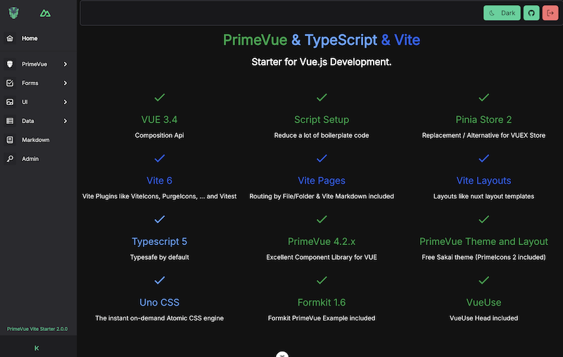

# Vite Typescript + PrimeVue Starter

Build your VUE.js App with the latest and fastest VITE Plugins (nuxt.js like).
First Class PrimeVUE support.



[](https://github.com/sfxcode/vite-primevue-starter/actions/workflows/main.yml)

THX to [antfu / Vitesse](https://github.com/antfu/vitesse) for starter code

## Features
 
- Vue 3.2 
- Vite 3
- Vitest (Testing Framework)
- Testing with cypress (e2e)
- Composition API
- Script Setup
- Routing VitePages / ViteLayout
- Pina as Store / CachedPiniaStore for effective data caching
- Validation with Vuelidate 2
- PrimeVue with Theme: Sakai (Free Admin Template)
- Validation, PrimeVue Form elements by [formkit-primevue](https://github.com/sfxcode/formkit-primevue)
- Markdown Support (VitePages)
- TypeScript 4.5
- UnoCSS
- SSG Support
- Eslint

### Modules
- i18n
- nprogress
- pinia
- primevue

## Variations

### nuxt3-primevue-starter

Nuxt3 Primevue Starter Template

[Github Repository](https://github.com/sfxcode/nuxt3-primevue-starter)

[App on Netlify](https://nuxt3-primevue-starter.netlify.app/)

- [Nuxt 3](https://v3.nuxtjs.org) - SSR, ESR, File-based routing, components auto importing, modules, etc.
- Vite - Instant HMR
- [UnoCSS](https://github.com/antfu/unocss) - The instant on-demand atomic CSS engine.
- Use icons from any icon sets in Pure CSS, powered by [UnoCSS](https://github.com/antfu/unocss)
- [State Management via Pinia](https://pinia.esm.dev)
- PrimeVue 3.12.x
- Logging

### vite-primevue-starter-lite

[Github Repository](https://github.com/sfxcode/vite-primevue-starter-lite)

[App on Netlify](https://vite-primevue-starter-lite.netlify.app/)

## Project setup and usage

Install node:

**Latest node LTS version required (16)**
Use node manager like **nvm** to install.

Install pnpm:
[https://pnpm.io/installation](https://pnpm.io/installation)

Install dependencies:

```
pnpm install
```

Run development server:

```
pnpm dev
```

Open Cypress test runner:

```
pnpm test:e2e
```

Component test runner:

```
pnpm test:unit
```

Run Cypress tests in headless mode:

```
pnpm test:ci
```

Build and preview built site locally:

```
pnpm preview
```

Build:

```
pnpm build
```

## Tools

I use IntelliJ with VUE.js and Prettier plugin.

## Supporters

JetBrains is supporting this open source project with:

[](http://www.jetbrains.com/idea/)

